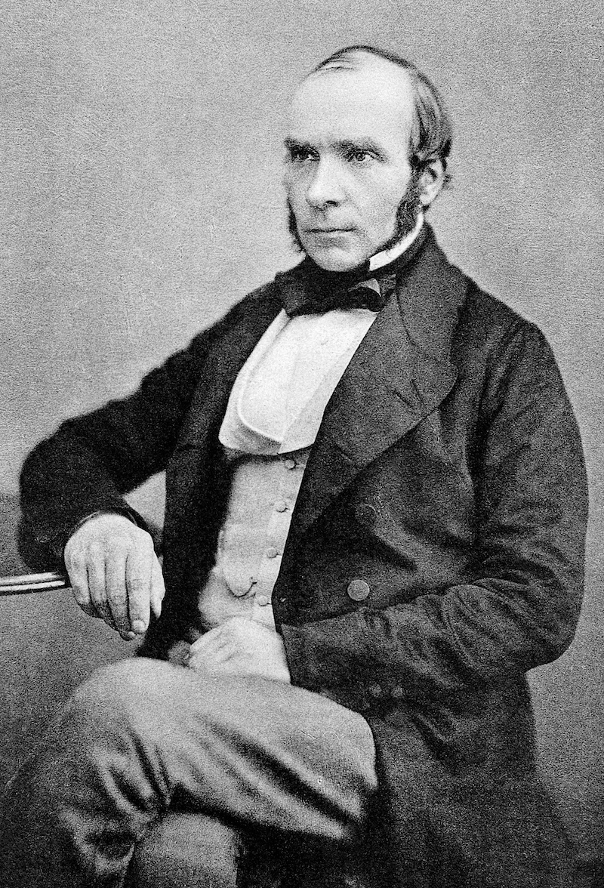
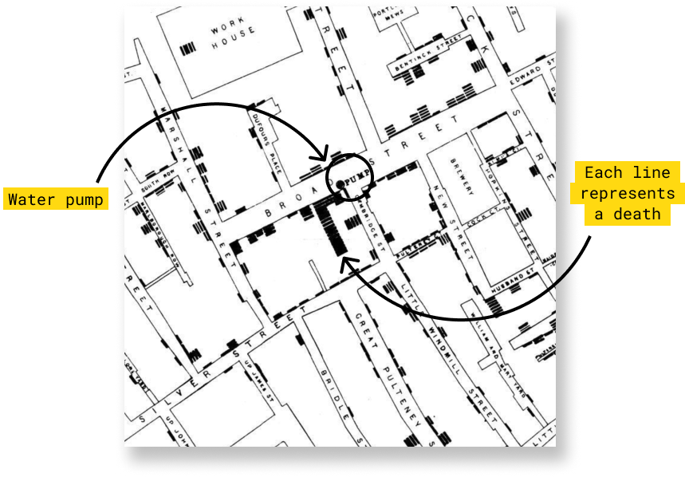
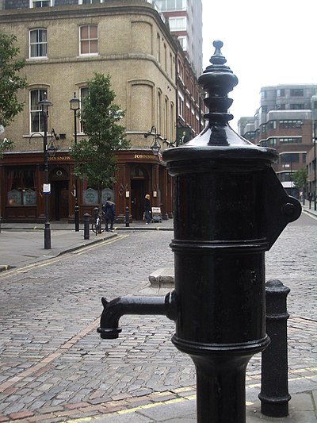

## Historia

En el siglo XIX, un médico inglés llamado John Snow dejó una huella indeleble en la historia de la epidemiología, convirtiéndose en el padre de esta disciplina. Aunque sus contribuciones al campo de la anestesia son notables, es su trabajo pionero en el análisis de datos y la visualización lo que lo hace memorable. Su hazaña más destacada: el mapa de las muertes en el Soho durante el brote de cólera de 1854. Este brote, que causó estragos en la población de Londres, se atribuyó en su mayoría al comercio de la marina mercante, al hacinamiento y a la insalubridad de las calles de una ciudad cuya población superaba los dos millones de habitantes. Sin embargo, John Snow se destacó por desafiar la creencia común de su época, sosteniendo que el cólera se transmitía a través de fuentes de agua contaminadas en lugar de la propagación por el aire.

Exploraremos la increíble odisea de John Snow mientras trataba de probar su teoría, demostrando la verdadera causa del brote de cólera de 1854 en Soho. Su famoso mapa, que trazaba las defunciones, reveló un patrón sorprendente: la mayoría de las muertes se concentraban en las cercanías de una bomba de agua pública. Este episodio no solo marcó un hito en la historia de la epidemiología, sino que también ilustra las complejidades y desafíos de superar el sesgo de confirmación arraigado en la teoría predominante de la transmisión del cólera por miasmas[^john_snow-1].

[^john_snow-1]: Según creencias o teorías antiguas el miasma es la sustancia fétida y perjudicial que emana de los cuerpos de seres enfermos o en estado de descomposición.

En el libro "The Ghost Map", de Steven Johnson, se relata la actuación de Snow en la identificación del origen del brote de cólera del Soho de 1854, destaca el ingenio y la perseverancia de John Snow en la búsqueda de la verdad científica, trascendiendo las barreras de la creencia convencional. Esta es la historia de un médico que no solo cambió la forma en que entendemos las enfermedades, sino también la importancia del análisis espacial y la visualización de datos en la ciencia.

## Importancia del Mapa

A principios de septiembre de 1854, un pequeño sector de Londres llamado Golden Square fue escenario de un brote epidémico de cólera de inusual intensidad, costando la vida a cerca de 500 personas en tan sólo 10 días. Snow planteó que el severo brote de cólera en Golden Square se debía a la ingestión de aguas contaminadas provenientes de esta bomba y se propuso, firmemente, demostrarlo. [@Cerda_L_2007].

John Snow venía utilizando desde hacía tiempo mapas en sus artículos y exposiciones como ayuda a la hora de argumentar sus hipótesis, por lo que aprovechó para comprar un mapa del barrio y, ayudado del párroco local Henry Whitehead, ir anotando en él las muertes que se habían producido por cólera en el mes de septiembre. Para ello recurrió al trabajo de campo, visitando uno por uno los edificios del área afectada, y ayudándose de los registros del hospital de Middlesex, a donde se trasladaban muchas de las víctimas.

El mapa recogía las defunciones con unas finas líneas de color negro que se iban apilando unas sobre las otras a medida que el número de decesos aumentaba. Con esta simple representación el mapa de John Snow trasmitía un claro mensaje visual al conectar incidencia con concentración. El resultado fue clarificador: la mayor parte de las muertes se habían producido en las proximidades de Broad Street. De igual manera Snow georreferenció sobre el mapa los pozos de agua, viéndose claramente como una gran cantidad de víctimas se concentraban en torno a la bomba de agua de Broad Street [@Cerda_L_2007].

Como vecino del área, Snow sabía que la mayoría de los residentes del sector extraían el agua a partir de una bomba de uso público ubicada en Broad Street. Prontamente, confirmó que la mayoría de los moradores se abastecían de agua extraída de la bomba de Broad Street. Calculó la distancia entre la residencia de cada difunto y la bomba de agua más cercana, observando que en 73 de 83 casos era la bomba de Broad Street y que 61 de 83 difuntos bebían de sus aguas contaminadas en forma constante u ocasional.

Entusiasmado por los hallazgos de su investigación, presentó los resultados ante la autoridad sanitaria local, quien decidió inhabilitar la bomba de Broad Street mediante la remoción de su palanca. La inhabilitación de la bomba de agua fue una medida altamente impopular entre los habitantes del sector, quienes no comprendían el sentido de la misma. Si la incidencia de casos de cólera disminuía, su teoría quedaría finalmente demostrad

En su planteamiento, no hacía sentido la ausencia de muertes entre los trabajadores de Lion Brewery -una cervecería aledaña a la bomba de agua- al igual que el escaso número de defunciones ocurrido en una hospedería para gente pobre, también cercana a la fuente y en la que solamente fallecieron cinco de sus 500 huéspedes. Snow averiguó que los trabajadores de la cervecería, temerosos de beber del agua de la bomba, únicamente bebían cerveza. De igual forma, la hospedería contaba con un arroyo privado para el suministro de agua potable, no necesitando del agua de la bomba. Finalmente, Snow logró recabar antecedentes de algunas personas que abandonaron el sector al inicio de la epidemia y que posteriormente fallecieron en otros puntos de la ciudad libres de cólera, demostrando que habían bebido agua extraída de la bomba de Broad Street días antes de morir.

## Conclusiones

Tras la inhabilitación de la polémica bomba, se observó una reducción en la incidencia y mortalidad por cólera, sin embargo, esto no fue suficiente para controlar el brote epidémico. Lamentablemente, la incredulidad de las autoridades sanitarias -quienes apoyaban la teoría miasmática- y la presión popular fue más fuerte, habilitándose nuevamente su uso. Snow intentó hasta su muerte en 1858 convencer a la comunidad médica que el cólera se transmitía mediante la ingestión de una "materia mórbida" presente en las aguas contaminadas del río Támesis, pero sus esfuerzos fueron infructuosos. Su teoría debió esperar la cuarta epidemia de cólera de Londres, ocurrida en 1866, para ser finalmente aceptada. Al poco tiempo, experimentos realizados por Louis Pasteur demostraron que son microorganismos presentes en el ambiente (y no "miasmas") los causantes de las enfermedades transmisibles. Casi tres décadas después de la muerte de Snow, Robert Koch aisló y cultivó el Vibrio cholerae, la "materia mórbida" a la cual recurrentemente se refería Snow, dándole total crédito a su hipótesis[@Cerda_L_2007].

En Londres, hoy en día es posible encontrar una réplica de la bomba de agua de Broad Street (actualmente Broadwick Street). Anualmente, la John Snow Society [@Ramsay_2006] rinde un homenaje a su persona, retirando y reposicionando la palanca de la bomba de agua, como una forma de recordar los múltiples desafíos que enfrenta continuamente la Salud Pública alrededor del mundo.

Sin disponer de un cuerpo de conocimientos microbiológicos y epidemiológicos como el existente hoy en día, Snow apeló a sus mejores virtudes -un agudo sentido de observación, razonamiento lógico y perseverancia- para caracterizar un problema de salud, desafiando a la comunidad médica y a la autoridad sanitaria, pensando únicamente en el bienestar de la comunidad. Con justa razón John Snow es considerado el padre de la epidemiología moderna, ejemplo del espíritu que todo médico investigador debe poseer [@Cerda_L_2007].

## Replicar Estudio

En un intento de rendir homenaje a la obra de John Snow y aplicar sus principios en la era de la Ciencia de Datos, se busca replicar la icónica investigación de Snow, pero con un enfoque moderno y la técnica de estimación de densidad mediante kernels (KDE).

Utilizando los datos muertes de Cólera de esta época se buscará determinar las concentraciones espaciales y hacer una relación de proximidad con las fuentes de agua pública, a modo de determinar origen del brode Cólera de 1854.

Este enfoque actualizado busca demostrat cómo la ciencia de datos y la programación pueden continuar el legado de Snow en la exploración de problemas de salud pública y epidemiología a través de análisis espacial y visualización de datos avanzados.

## Referencias

-   [John Snow, la epidemia de cólera y el nacimiento de la epidemiología moderna](https://www.scielo.cl/pdf/rci/v24n4/art14.pdf)

-   [(Mostly Clinical) Epidemiology with R](https://bookdown.org/jbrophy115/bookdown-clinepi/vis.html#using-modern-geographic-information-system-mapping)

-   [Floursh: Masters series: John Snow's cholera map](https://flourish.studio/blog/masters-john-snow/)

-   [John Snow 210th Birthday Map Competition](https://johnsnowsociety.org/broadsheets-lectures-social/#SocialMedia)

-   [HistData R Package](https://friendly.github.io/HistData/)
